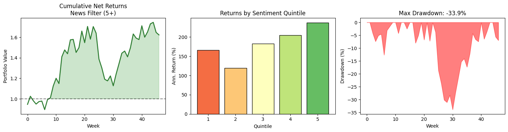

# News Sentiment Analysis for Stock Returns

Does financial news sentiment actually predict stock returns? I wanted to find out.

## Results at a Glance

| Metric | Value |
|--------|-------|
| Information Coefficient | 0.71% daily |
| Fama-French Alpha | 15% annualized (t=2.73) |
| Best Strategy Sharpe | 1.26 |
| Net Return | +67.6% |
| Dataset | 328K headlines, 384 stocks, 2009–2020 |

## What This Is

This project tests whether sentiment extracted from financial news headlines has any predictive power for stock returns. The idea is simple: use FinBERT (a BERT model fine-tuned on financial text) to score ~330K news headlines from 2009–2020, then see if stocks with positive news actually outperform stocks with negative news.

The focus here isn't on building a profitable trading system — it's about isolating sentiment as a signal and measuring its statistical significance.

## The Approach

1. **Data**: Pulled news headlines covering S&P 500 stocks over 11 years
2. **Sentiment Scoring**: Used FinBERT to classify each headline as positive/negative/neutral
3. **Signal Construction**: Aggregated daily sentiment scores for each stock
4. **Testing**: Built long-short portfolios based on sentiment deciles and measured forward returns

The key tests:
- Information Coefficient (IC) analysis to measure rank correlation between sentiment and returns
- Fama-French factor regression to see if sentiment adds explanatory power beyond standard factors
- Multiple time horizons (1-day, 2-day, weekly) to check signal persistence

## Results

### IC Distribution & Signal Decay


The left plot shows daily IC distribution centered slightly positive. The right plot shows IC decays from 0.71% (1-day) to 0.30% (10-day) as information gets priced in.

### Decile Portfolio Performance


Long-short spread (D10 − D1) cumulates to +160% over the sample period. Middle deciles are noisy, but extremes show clear separation.

### Strategy Comparison



Weekly rebalancing with 5+ news filter produces the best risk-adjusted returns (Sharpe 1.26).

## Key Findings

Sentiment does show up as a statistically significant factor:

- **IC is positive but modest** — typical for sentiment signals in liquid markets
- **Alpha survives factor adjustment** — Fama-French regression shows t-stat of 2.73
- **Signal decays quickly** — daily rebalancing gets killed by transaction costs
- **News volume matters** — filtering for 5+ headlines/week dramatically improves signal quality

## What I Learned

- **Rebalancing frequency is critical**: Daily trading destroys alpha through transaction costs; weekly is the sweet spot
- **High-conviction filters work**: Stocks with more news coverage have cleaner signals
- **Factor attribution matters**: Raw returns look good, but you need to check if it's just market/size/value exposure
- **Sentiment is a weak but real signal**: Don't expect Sharpe > 2, but it can be a useful overlay

## Tech Stack

- **FinBERT**: Pre-trained sentiment model from HuggingFace
- **Data Processing**: pandas, numpy
- **Modeling**: PyTorch for transformer inference
- **Statistics**: statsmodels for Fama-French regression
- **Environment**: Google Colab with T4 GPU

## Project Structure

```
├── FinBERT_Sentiment_Analysis.ipynb   # Full analysis notebook
├── README.md
└── images/
    ├── ic_analysis.png
    ├── decile_returns.png
    └── strategy_comparison.png
```

## Full Analysis

See the complete methodology in [`FinBERT_Sentiment_Analysis.ipynb`](./FinBERT_Sentiment_Analysis.ipynb)

## Notes

This was a learning project to understand NLP in finance and factor research methodology. The code includes checkpointing for the sentiment scoring (because processing 330K headlines takes a while) and some basic transaction cost modeling.

Feel free to poke around — feedback welcome!
